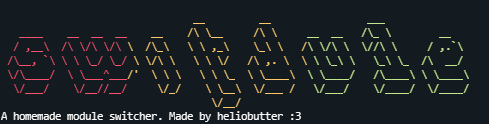

<p align="center">
    
  </a>
</p>

<div align="center">
  <b>A simple module switcher to switch different modules in one directory.</b>
</div>

---

## About

switdule is simple package to switching different modules/project in one directory/hosting

This is very useful if you want to use 2 or more modules in one hsoting for saving money and resource

## Features

- Switch module using **text file** to make _easier way_
- Maximum of modules are **infinite**, __*you can customize as many as you want*__
- Compatible on Hosting CLI-only or GUI-only

## Setup

```javascript
const SwitchHandler = require('switdule');

new SwitchHandler({
  switchFile: './switch.txt', // change this to your switcher text file
  trueStates: ['ON', 'ENABLE'], // you can add more states here to make you can switch more modules
  falseStates: ['OFF', 'DISABLE'], // you can add more states here to make you can switch more modules
  onTrue: () => console.log('System is ENABLED!'), // if trueStates in switchFile matched, do code here
  onFalse: () => console.log('System is DISABLED!'), // if falseStates in switchFile matched, do code here
  onInvalid: (value) => console.log(`Invalid switch value: "${value}"`) // if states given on switchFile invalid, do code here
});
```

### Options
>[!NOTE]
>Options who have a leading question mark (?) are optional and **not required**, however if you want to use them, make sure to remove it!

```javascript
const SwitchHandler = require('switdule');

new SwitchHandler({
switchFile: string,
trueStates: ["true","yes"],
falseStates: ["false","no"],
onTrue: (state) => console.log("true", state),
onFalse: (state) => console.log("false", state),
onInvalid?: (state) => console.log("invalid", state),
showBanner?: boolean,
bannerText?: string,
bannerGradient?: array
});
```
### Contribution

We welcome contributions from everyone! Here's how to contribute this project:
1. **Fork** this repository and **Clone** your fork:
```bash
git clone https://github.com/heliobutterx10/switdule.git
```
2. **Create a new branch** for your feature or fix:
```bash
git checkout -b feature-or-fix
```
3. **Make your changes** and commit with a clear message:
```bash
git commit -m "feat: describe your feature or fix"
```
4. **Push** to your forked repository:
```bash
git push origin feature-or-fix
```
5. **Open a Pull Request** to the `main` branch
- Clearly explain what you changed
- Include screenshots or logs if necessary
- Link related issues (if any)